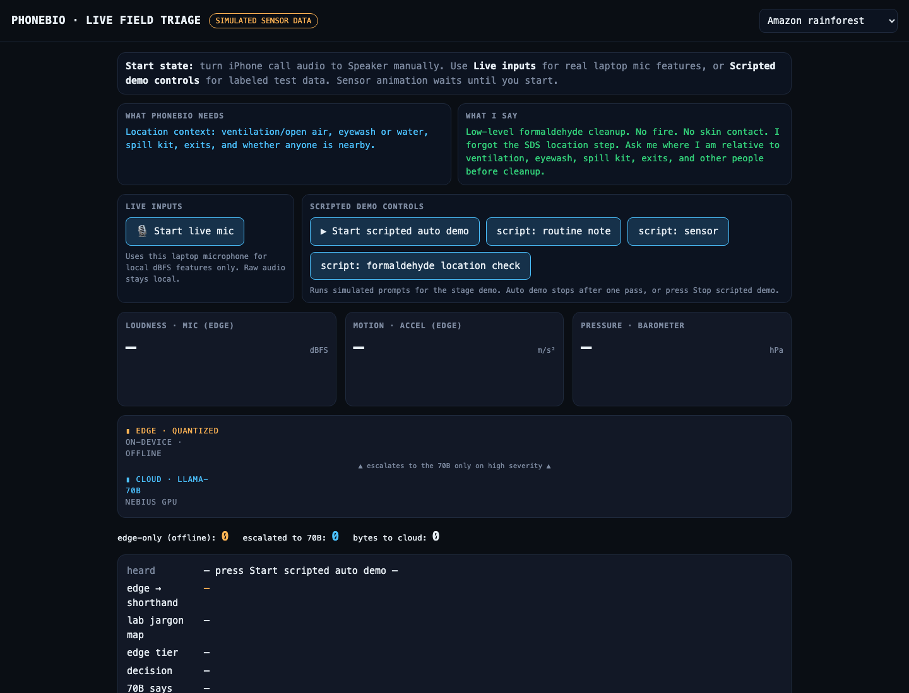
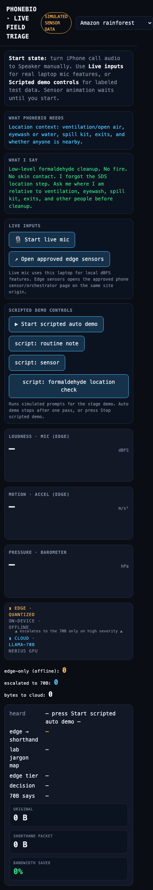

# PhoneBio

PhoneBio is a hackathon voice-agent prototype for a field biology worker with limited or degraded connectivity. The worker can call a Vapi phone number and ask for protocols, safety material, hardware troubleshooting, disaster triage capture, or sensor-based reasoning even when mobile data/app sync is unavailable. Screen/app interaction can help when available, but it is not required.

## Live Demo

Public demo page:

```text
https://qfdp5nuv.insforge.site/live.html
```

Use [`docs/LIVE_DEMO_SCRIPT.md`](docs/LIVE_DEMO_SCRIPT.md) for the in-person
judge run sheet. Use [`docs/DEMO_VIDEO_SCRIPT.md`](docs/DEMO_VIDEO_SCRIPT.md)
for the recorded-video script.

The page is designed for the live and recorded scripts: the left panel shows
what PhoneBio needs, the right panel shows what to say, and the lower panels
show laptop mic/sensor signals, edge-vs-70B routing, shorthand compression,
and bandwidth savings.



The same page can be saved to an iPhone Home Screen for the pre-field setup
story. Sensor/microphone permissions should be granted before the no-touch demo.



## v1 Shape

- Vapi answers inbound calls with one assistant and five source-backed tools.
- InsForge is the website/app hosting, Vapi webhook, custom-LLM proxy, and deterministic backend surface.
- Nebius Token Factory is the live GPU/model reasoning layer when `NEBIUS_API_KEY` is configured; the proxy always forwards tool schemas and falls back only on real upstream failure.
- A local FastAPI webhook serves tool results from repository data only.
- A dependency-free Node webhook remains available as a local fallback.
- Phone sensor support is treated as narrated or app-provided readings: accelerometer, gyroscope, gesture/pocket context, magnetometer, barometer, microphone/acoustic context, UWB, LiDAR, and GPS where available.
- Camera-dependent workflows are out of scope for v1.
- Voice-first operation is required: the caller may be wearing PPE, handling contaminated equipment, or collecting disaster-relief observations. Screen/app interaction is optional when safe and available.
- Call-only degraded service is a first-class mode: cellular voice may work while mobile data, maps, uploads, and app APIs fail on the field device.

## Local Run

Primary FastAPI runtime:

```bash
python3 -m pip install -r requirements.txt
make test
make readiness
make dev
```

Node fallback:

```bash
npm test
npm start
```

Expose the full app for live Vapi testing:

```bash
make tunnel
export PUBLIC_BASE_URL="https://your-public-url"
make public-probe
```

`make expose` starts Vapi CLI webhook forwarding only. The current checked-in
assistant uses the hosted InsForge webhook plus the hosted InsForge
`phonebio-llm` custom-LLM proxy for Nebius Token Factory.

Configure the Vapi assistant using `vapi/assistant.field-biology-worker.json` as the dashboard/API reference. Set the assistant server URL to the forwarded webhook URL.

Dry-run Vapi wiring:

```bash
make wire-dry-run
make hosted-probe
make vapi-preflight
make vapi-tools
make vapi-verify-call
make vapi-wait-call
python3 vapi/wire.py list-phone-numbers
```

During the live demo, use the fast read-only guard instead of the heavier
repairing preflight:

```bash
make live-demo-guard
```

Local v1 readiness status:

```bash
make readiness
make prefield-check
```

This reports all locally provable requirements and leaves live Vapi phone assignment blocked until credentials and public URLs are supplied.

Local Ollama custom-LLM tool-call probe:

```bash
make llm-probe
```

This verifies the configured local model emits a Vapi-compatible tool call and that model reasoning fields are scrubbed before returning to Vapi.

Nebius Token Factory probe, after hackathon/free credits are active:

```bash
export NEBIUS_API_KEY="..."
export LLM_PROVIDER_ORDER=nebius,local
make nebius-models
make nebius-probe
```

This follows the cookbook `NEBIUS_API_KEY` setup and uses Nebius's
OpenAI-compatible chat-completions endpoint. The live demo path tries Nebius
first and forwards tools on every model request; deterministic fallback
responses are allowed only when the Nebius/network path fails and must be
labeled as fallback output.

Provider/credit routing is documented in `docs/PROVIDER_STRATEGY.md`.
Vapi dashboard resource usage is documented in `docs/VAPI_RESOURCE_STRATEGY.md`.
Pre-field setup is documented in `docs/PREFIELD_SETUP.md`.
The 3 minute video script is in `docs/DEMO_VIDEO_SCRIPT.md`.
Gregg/SeedGraph corpus ingestion is scoped in `docs/GREGG_SEEDGRAPH_INGEST_PLAN.md`.
Camera-free sensor context is scoped in `docs/SENSOR_CONTEXT_STRATEGY.md`.
Hands-free/PPE/disaster mode is scoped in `docs/HANDS_FREE_DISASTER_MODE.md`.
Call-only degraded connectivity is scoped in `docs/DEGRADED_CONNECTIVITY_MODE.md`.
IoT/sensor processing lanes are scoped in `docs/IOT_SENSOR_PROCESSING_STRATEGY.md`.
Legacy equipment database planning is in `docs/LEGACY_EQUIPMENT_DATABASE_PLAN.md`.
Additional built-in and external sensor options are in `docs/ADDITIONAL_SENSOR_OPTIONS.md`.
Sensor triage limits and fusion rules are in `docs/SENSOR_TRIAGE_MATRIX.md`.
Rainforest, desert, and field-station operating modes are in `docs/FIELD_ENVIRONMENT_MODES.md`.
iPhone 11-specific sensor availability is in `docs/IPHONE_11_FIELD_PROFILE.md`.
Basic first-aid kit support boundaries are in `docs/BASIC_FIRST_AID_KIT_MODE.md`.
Public emergency alert context is scoped in `docs/PUBLIC_ALERT_CONTEXT.md`.
Stage test-call setup and the public signal dashboard are in `docs/STAGE_TEST_CALL_GUIDE.md`.
The simulated local quantized orchestrator and ExecuTorch target path are in `docs/EXECUTORCH_LOCAL_ORCHESTRATOR.md`.

Public demo dashboard:

```text
https://qfdp5nuv.insforge.site/live.html
```

The live page shows the simple demo surface: sensor lines, laptop microphone
loudness, edge-vs-70B processing, bandwidth/shorthand compression, and the
low-level formaldehyde location-check script.

Local hackathon call-script replay:

```bash
make demo-call
make hosted-demo
```

This replays the protocol, safety, hardware, sensor, and shorthand turns from the Vapi demo script against the local webhook tools and hosted InsForge function.

InsForge backend preview:

```bash
python3 scripts/insforge_export.py --summary
make insforge-export > /tmp/phonebio-insforge-seed.jsonl
```

The migration in `migrations/` and seed export are for reviewed persistence only; v1 still runs file-local.

Live Vapi wiring needs `VAPI_API_KEY` or `VAPI_PRIVATE_KEY`, `VAPI_PHONE_NUMBER_ID`, and `VAPI_WEBHOOK_URL` or `PUBLIC_BASE_URL`. See `docs/VAPI_RUNBOOK.md`.

## Tool Names

- `get_protocol`
- `get_safety_sheet`
- `troubleshoot_hardware`
- `interpret_sensor_report`
- `compress_observation`

## Runtime Boundary

The local webhook does not call the internet. The live hackathon path uses Vapi
for the phone agent, the hosted InsForge function for tool dispatch, and the
hosted InsForge custom-LLM proxy for Nebius GPU reasoning. The field device only
needs enough cellular service to place a voice call; server-side services handle
tool dispatch and downstream records. No OpenAI API key is used. InsForge
credentials are needed only to redeploy or change the hosted functions or to add
persistence.

The hosted `phonebio-llm` proxy is intentionally simple: it forwards the Vapi
messages and tool schemas to Nebius, streams the upstream answer or tool call
back to Vapi, and returns `phonebio-deterministic-fallback` only if the Nebius
key, network, timeout, or upstream status fails.

Ollarma status on 2026-06-19: reachable but degraded with `SELECTION_STALE`; Watchtower bridge aggregator unreachable. See `docs/OLLARMA_CLAUDE_HANDOFF.md`.

Optional custom LLM endpoint:

- `GET /llm/health`
- `POST /custom-llm/chat/completions`

This route uses local Ollama only. The default local model is `qwen3:1.7b` because it emits tool calls in the local probe; no cloud LLM key is used.
